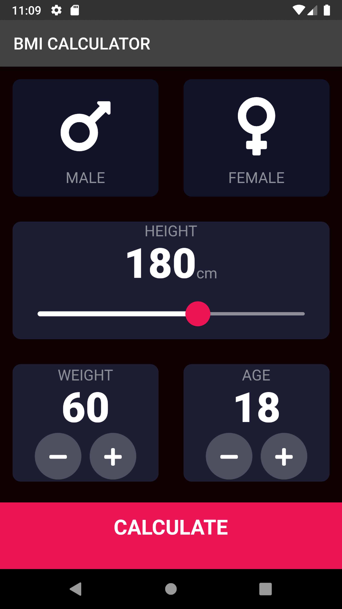
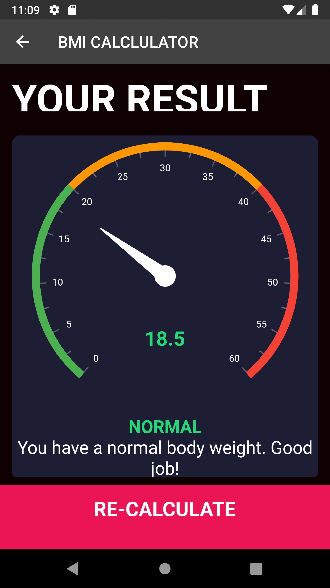

# WeightLossGenie (Health Assistant)
It helps you to determine your health level.
Also, it helps to improve your health.

The application is designed to calculate your 
Body Mass Index
Body Fat 
Waist-to-Hip Ratio 
Ideal Weight and 
Weight Loss
Also, you can check your history
It works for  male and female of any age.

 

The BMI UI of the application 
<table>
 <tr>
    <td></td>
    <td></td>
  </tr>
</table>

User can select their Gender, Height, Weight, and Age

Upon clicking, the CALCULATE button at the bottom of the screen the page navigates to a new screen where

Also you can check personalized Page which maintain records. So you can find whether you are going upward or downward.
